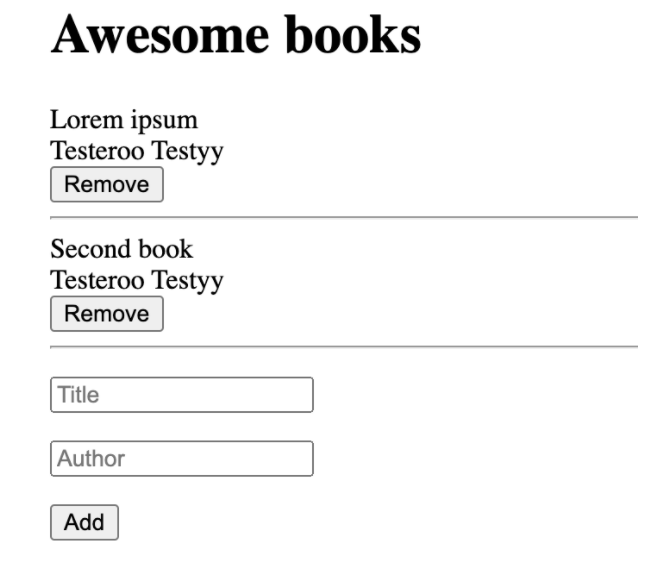

# Project Name

> "Awesome books" is a simple website that displays a list of books and allows you to add and remove books from that list.

Additional description about the project and its features.

## Built With

- HTML
- CSS
- JAVASCRIPT

## Live Demo

[Live Demo Link](https://livedemo.com)

## Getting Started

Download the project, unzip it and open index.html file in the browser

## Authors

👤 **Pedro Guerreiro**

- GitHub: [@pepedropo1](https://github.com/pepedropo1)
- Twitter: [@pepedrop01](https://twitter.com/pepedrop01)
- LinkedIn: [Pedro Guerreiro](https://www.linkedin.com/in/pepedropo1/)

👤 **JihaneH**

- GitHub: [@githubhandle](https://github.com/jihaneH)
- Twitter: [@twitterhandle](https://twitter.com/jijihaddad)
- LinkedIn: [LinkedIn](https://linkedin.com/in/jihane-haddad/)

## 🤝 Contributing

Contributions, issues, and feature requests are welcome!

Feel free to check the [issues page](../../issues/).

## Show your support

Give a ⭐️ if you like this project!

## 📝 License

This project is [MIT](./MIT.md) licensed.
